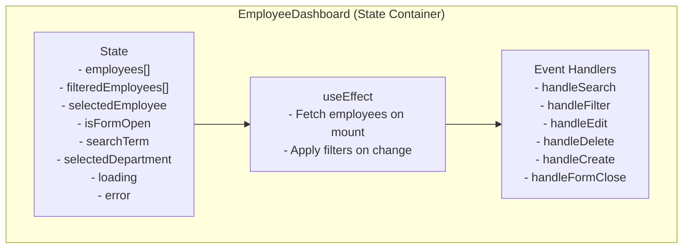
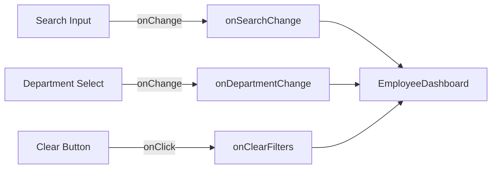
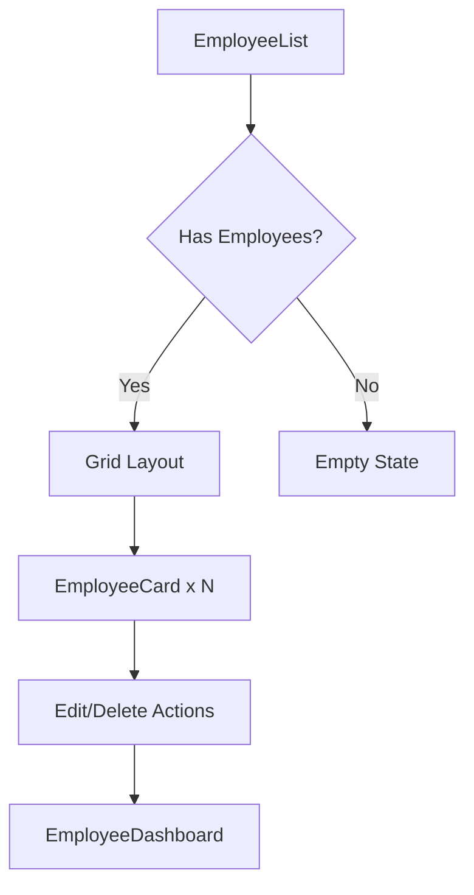
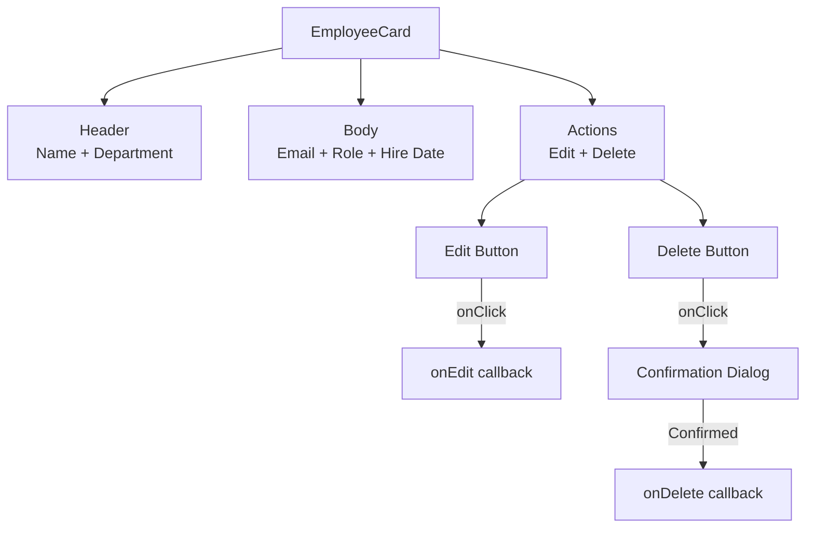
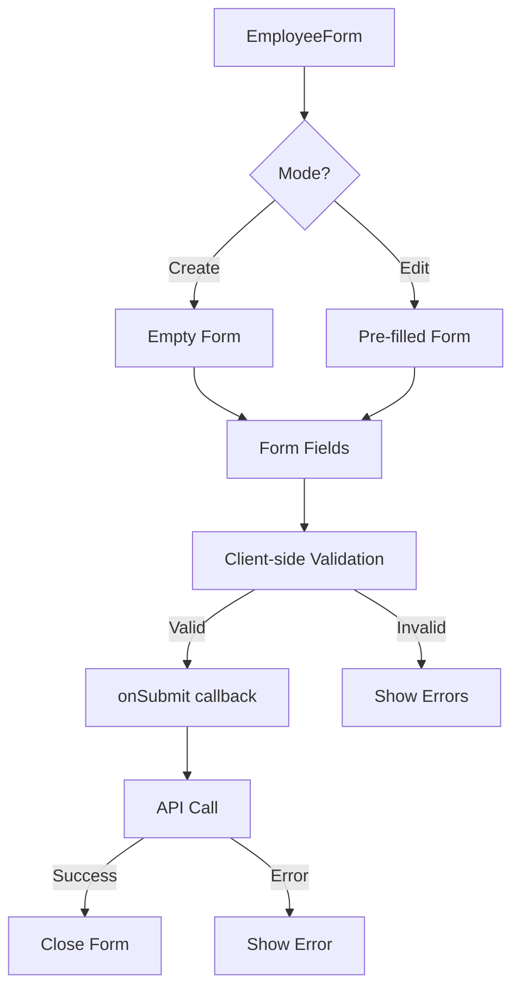
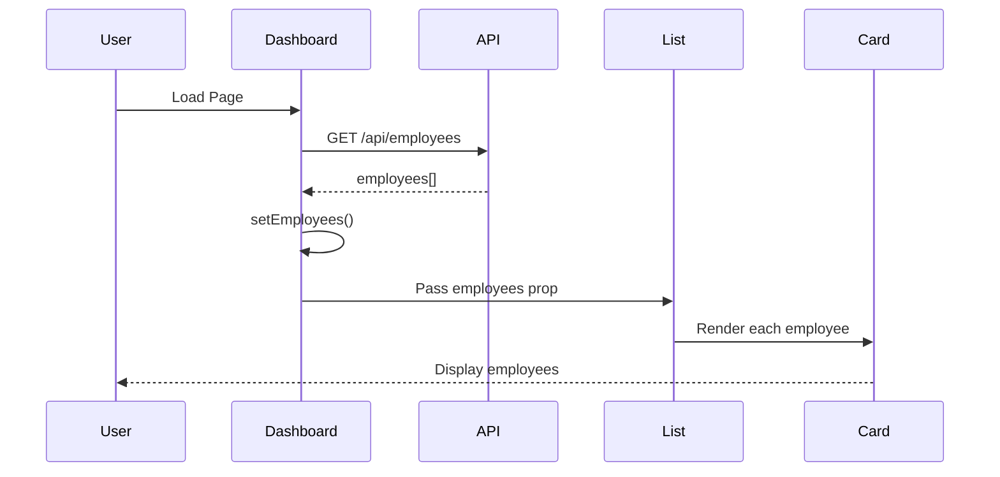
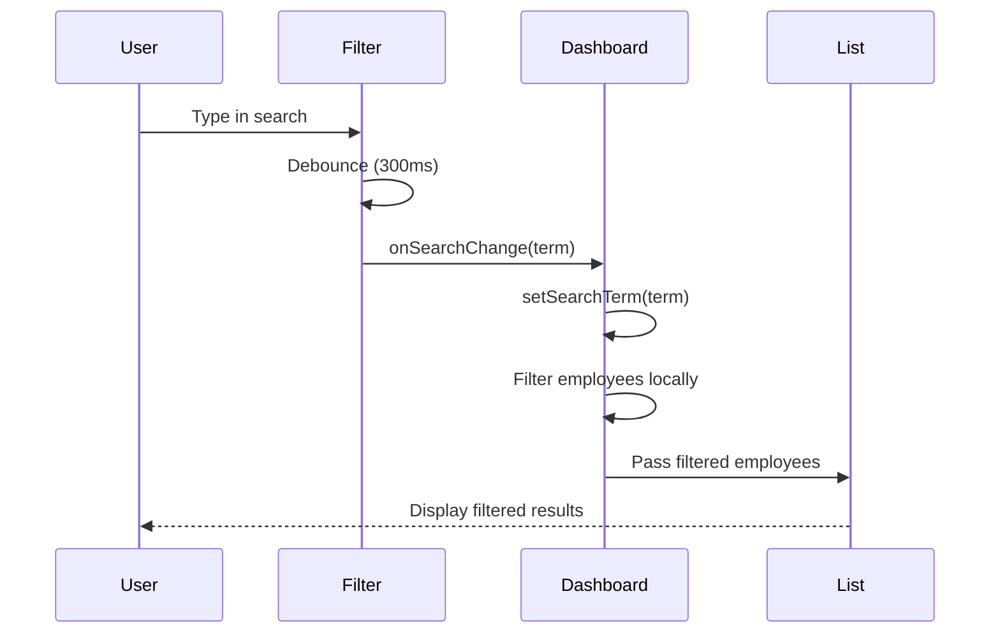
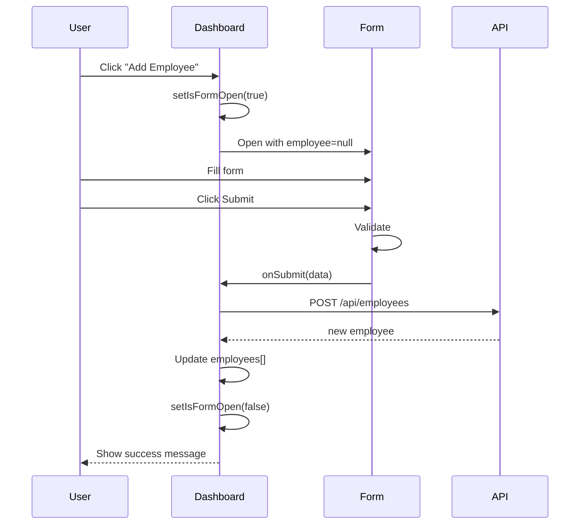
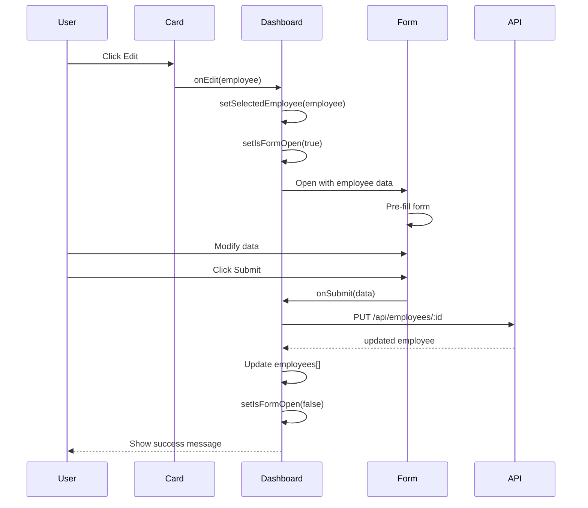
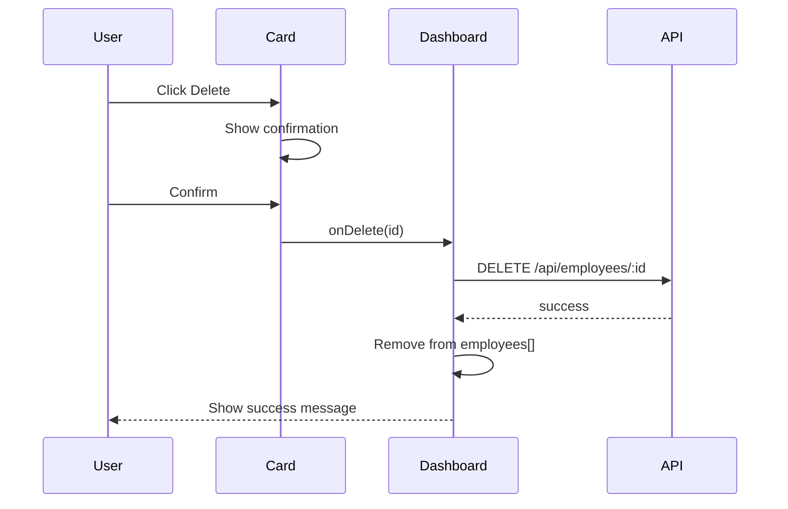

# Employee Management System - Component Architecture

Visual guide to the component structure and data flow.

---

## Frontend Component Tree

```
App
└── EmployeeDashboard
    ├── EmployeeFilter
    │   ├── SearchInput
    │   └── DepartmentSelect
    ├── EmployeeList
    │   └── EmployeeCard (multiple)
    │       ├── EmployeeDetails
    │       └── ActionButtons
    └── EmployeeForm (Modal)
        ├── FormInput (name)
        ├── FormInput (email)
        ├── FormInput (department)
        ├── FormInput (role)
        ├── FormInput (hire_date)
        └── FormButtons (Submit/Cancel)
```

---

## Component Diagrams

### 1. EmployeeDashboard (Container Component)



**Responsibilities:**
- Fetch employee data from API
- Manage application state
- Apply search and filter logic
- Handle CRUD operations
- Coordinate child components

**State Management:**
```javascript
const [employees, setEmployees] = useState([]);
const [filteredEmployees, setFilteredEmployees] = useState([]);
const [selectedEmployee, setSelectedEmployee] = useState(null);
const [isFormOpen, setIsFormOpen] = useState(false);
const [searchTerm, setSearchTerm] = useState('');
const [selectedDepartment, setSelectedDepartment] = useState('');
const [loading, setLoading] = useState(false);
const [error, setError] = useState(null);
```

---

### 2. EmployeeFilter (Controlled Component)



**Props Interface:**
```typescript
interface EmployeeFilterProps {
  searchTerm: string;
  selectedDepartment: string;
  departments: string[];
  onSearchChange: (term: string) => void;
  onDepartmentChange: (dept: string) => void;
  onClearFilters: () => void;
}
```

**Features:**
- Controlled inputs (value from props)
- Debounced search (300ms)
- Department dropdown with "All" option
- Clear filters button

---

### 3. EmployeeList (Presentational Component)



**Props Interface:**
```typescript
interface EmployeeListProps {
  employees: Employee[];
  loading: boolean;
  error: string | null;
  onEdit: (employee: Employee) => void;
  onDelete: (id: number) => void;
}
```

**States:**
- **Loading State**: Displays spinner
- **Error State**: Shows error message
- **Empty State**: "No employees found"
- **Success State**: Grid of employee cards

---

### 4. EmployeeCard (Presentational Component)



**Props Interface:**
```typescript
interface EmployeeCardProps {
  employee: Employee;
  onEdit: (employee: Employee) => void;
  onDelete: (id: number) => void;
}
```

**Layout:**
```
┌─────────────────────────────┐
│ Name            [Department]│
├─────────────────────────────┤
│ 📧 Email                    │
│ 💼 Role                     │
│ 📅 Hire Date                │
├─────────────────────────────┤
│     [Edit]  [Delete]        │
└─────────────────────────────┘
```

---

### 5. EmployeeForm (Smart Component)



**Props Interface:**
```typescript
interface EmployeeFormProps {
  employee: Employee | null;  // null for create, object for edit
  isOpen: boolean;
  onClose: () => void;
  onSubmit: (data: Employee) => Promise<void>;
}
```

**Form State:**
```javascript
const [formData, setFormData] = useState({
  name: '',
  email: '',
  department: '',
  role: '',
  hire_date: ''
});

const [errors, setErrors] = useState({});
const [submitting, setSubmitting] = useState(false);
```

**Validation Rules:**
- Name: Required, min 2 characters
- Email: Required, valid email format
- Department: Required
- Role: Required
- Hire Date: Required, format YYYY-MM-DD

---

## Data Flow Diagrams

### Employee List Flow



---

### Search Flow



---

### Create Employee Flow



---

### Edit Employee Flow



---

### Delete Employee Flow



---

## Component Props Reference

### EmployeeDashboard

**Props:** None (root page component)

**Internal State:**
```typescript
{
  employees: Employee[];
  filteredEmployees: Employee[];
  selectedEmployee: Employee | null;
  isFormOpen: boolean;
  searchTerm: string;
  selectedDepartment: string;
  loading: boolean;
  error: string | null;
}
```

**Child Components:**
- EmployeeFilter
- EmployeeList
- EmployeeForm

---

### EmployeeFilter

**Props:**
```typescript
{
  searchTerm: string;                    // Current search term
  selectedDepartment: string;            // Current department filter
  departments: string[];                 // List of all departments
  onSearchChange: (term: string) => void;
  onDepartmentChange: (dept: string) => void;
  onClearFilters: () => void;
}
```

**Emits:**
- onSearchChange: When search input changes
- onDepartmentChange: When department selection changes
- onClearFilters: When clear button clicked

---

### EmployeeList

**Props:**
```typescript
{
  employees: Employee[];                 // Employees to display
  loading: boolean;                      // Loading state
  error: string | null;                  // Error message
  onEdit: (employee: Employee) => void;
  onDelete: (id: number) => void;
}
```

**Emits:**
- onEdit: When edit button clicked on any card
- onDelete: When delete confirmed on any card

**Child Components:**
- EmployeeCard (one per employee)

---

### EmployeeCard

**Props:**
```typescript
{
  employee: Employee;                    // Employee data
  onEdit: (employee: Employee) => void;
  onDelete: (id: number) => void;
}
```

**Emits:**
- onEdit: When edit button clicked
- onDelete: When delete button clicked and confirmed

---

### EmployeeForm

**Props:**
```typescript
{
  employee: Employee | null;             // null = create, object = edit
  isOpen: boolean;                       // Modal visibility
  onClose: () => void;
  onSubmit: (data: Employee) => Promise<void>;
}
```

**Emits:**
- onClose: When modal should close
- onSubmit: When form is submitted with valid data

**Internal State:**
```typescript
{
  formData: {
    name: string;
    email: string;
    department: string;
    role: string;
    hire_date: string;
  };
  errors: {
    name?: string;
    email?: string;
    department?: string;
    role?: string;
    hire_date?: string;
  };
  submitting: boolean;
}
```

---

## Styling Architecture

### CSS Modules Structure

Each component has its own CSS module:

```
EmployeeCard/
├── EmployeeCard.jsx
├── EmployeeCard.module.css
└── EmployeeCard.test.jsx
```

### Class Naming Convention

```css
/* EmployeeCard.module.css */

.card {
  /* Container styles */
}

.card__header {
  /* Header section */
}

.card__body {
  /* Body section */
}

.card__footer {
  /* Footer/actions section */
}

.card__name {
  /* Employee name */
}

.card__department {
  /* Department badge */
}

.card--loading {
  /* Loading state modifier */
}

.card--error {
  /* Error state modifier */
}
```

### BEM-like Naming

- **Block:** `.card`
- **Element:** `.card__header`
- **Modifier:** `.card--loading`

---

## State Management Patterns

### 1. Lifting State Up

State is managed in the nearest common ancestor:

```
EmployeeDashboard (manages all state)
├── EmployeeFilter (receives state, emits events)
└── EmployeeList (receives state, emits events)
```

### 2. Prop Drilling

Props are passed down through component tree:

```
Dashboard → List → Card
```

**Alternative:** Could use Context API for deeply nested props.

### 3. Derived State

Filtered employees are derived from search/filter state:

```javascript
useEffect(() => {
  let filtered = employees;
  
  if (searchTerm) {
    filtered = filtered.filter(emp =>
      emp.name.toLowerCase().includes(searchTerm.toLowerCase())
    );
  }
  
  if (selectedDepartment) {
    filtered = filtered.filter(emp =>
      emp.department === selectedDepartment
    );
  }
  
  setFilteredEmployees(filtered);
}, [employees, searchTerm, selectedDepartment]);
```

---

## Performance Optimizations

### 1. Debouncing Search

Prevent excessive filtering on every keystroke:

```javascript
const useDebounce = (value, delay) => {
  const [debouncedValue, setDebouncedValue] = useState(value);
  
  useEffect(() => {
    const handler = setTimeout(() => {
      setDebouncedValue(value);
    }, delay);
    
    return () => clearTimeout(handler);
  }, [value, delay]);
  
  return debouncedValue;
};
```

### 2. Memoization

Prevent unnecessary re-renders:

```javascript
const filteredEmployees = useMemo(() => {
  return employees.filter(emp => {
    const matchesSearch = emp.name
      .toLowerCase()
      .includes(searchTerm.toLowerCase());
    const matchesDept = !selectedDepartment || 
                        emp.department === selectedDepartment;
    return matchesSearch && matchesDept;
  });
}, [employees, searchTerm, selectedDepartment]);
```

### 3. React.memo

Prevent re-rendering of pure components:

```javascript
const EmployeeCard = React.memo(({ employee, onEdit, onDelete }) => {
  // Component implementation
});
```

### 4. Callback Memoization

Prevent re-creating callback functions:

```javascript
const handleEdit = useCallback((employee) => {
  setSelectedEmployee(employee);
  setIsFormOpen(true);
}, []);

const handleDelete = useCallback(async (id) => {
  await api.deleteEmployee(id);
  setEmployees(prev => prev.filter(emp => emp.id !== id));
}, []);
```

---

## Component Testing Strategy

### Unit Tests

**EmployeeFilter:**
- ✅ Renders search input
- ✅ Renders department select
- ✅ Calls onSearchChange when typing
- ✅ Calls onDepartmentChange when selecting
- ✅ Clears filters when clicking clear button

**EmployeeCard:**
- ✅ Displays employee data correctly
- ✅ Calls onEdit when edit clicked
- ✅ Shows confirmation before delete
- ✅ Calls onDelete when confirmed

**EmployeeForm:**
- ✅ Renders all form fields
- ✅ Validates required fields
- ✅ Validates email format
- ✅ Validates date format
- ✅ Pre-fills form in edit mode
- ✅ Calls onSubmit with valid data
- ✅ Prevents submission with invalid data

### Integration Tests

**EmployeeDashboard:**
- ✅ Fetches and displays employees on mount
- ✅ Filters employees by search term
- ✅ Filters employees by department
- ✅ Opens form in create mode
- ✅ Opens form in edit mode
- ✅ Creates employee successfully
- ✅ Updates employee successfully
- ✅ Deletes employee successfully
- ✅ Handles API errors gracefully

---

## Accessibility Considerations

### Keyboard Navigation

All interactive elements are keyboard accessible:

```jsx
<button
  onClick={handleEdit}
  onKeyPress={(e) => e.key === 'Enter' && handleEdit()}
  tabIndex={0}
>
  Edit
</button>
```

### ARIA Labels

```jsx
<input
  type="text"
  id="search"
  name="search"
  aria-label="Search employees by name"
  placeholder="Search by name..."
/>

<button
  onClick={handleDelete}
  aria-label={`Delete employee ${employee.name}`}
>
  Delete
</button>
```

### Focus Management

```javascript
useEffect(() => {
  if (isFormOpen) {
    // Focus first input when form opens
    formRef.current?.querySelector('input')?.focus();
  }
}, [isFormOpen]);
```

---

## Future Enhancements

### State Management

**Current:** useState in parent component  
**Future:** Redux or Context API for complex state

### Code Splitting

**Current:** All components loaded upfront  
**Future:** Lazy load modal components

```javascript
const EmployeeForm = React.lazy(() => import('./EmployeeForm'));
```

### Virtual Scrolling

**Current:** Render all employees  
**Future:** Virtual scrolling for 1000+ employees

```javascript
import { FixedSizeList } from 'react-window';
```

---

**Last Updated:** 2024-02-12  
**Version:** 1.0
