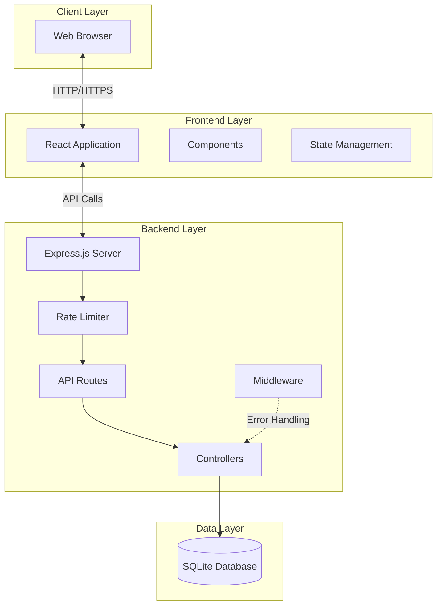
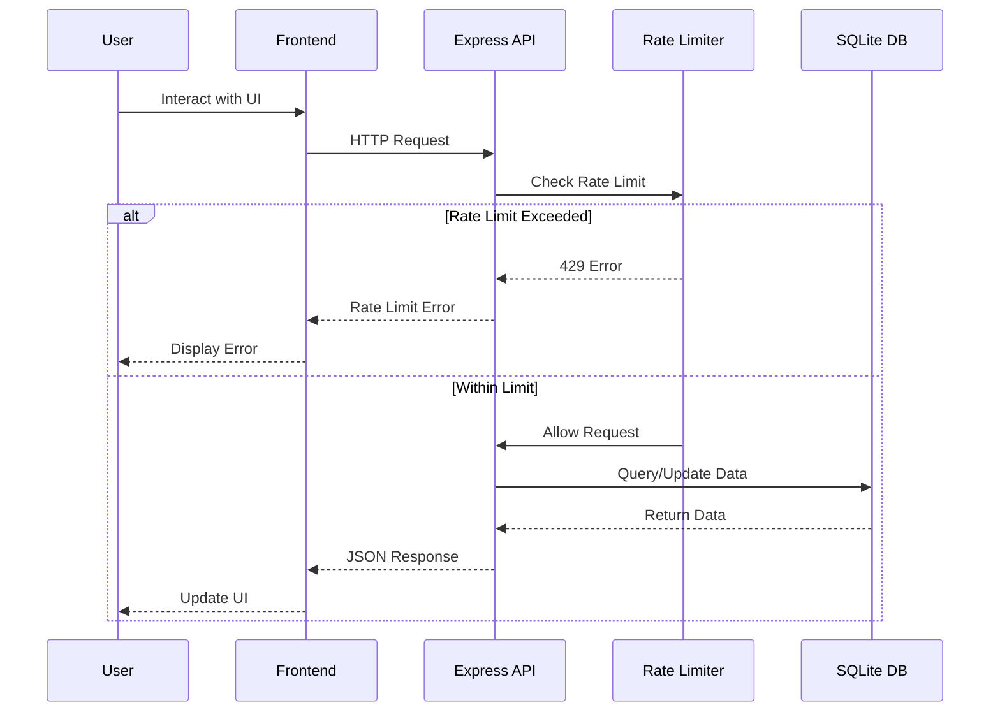
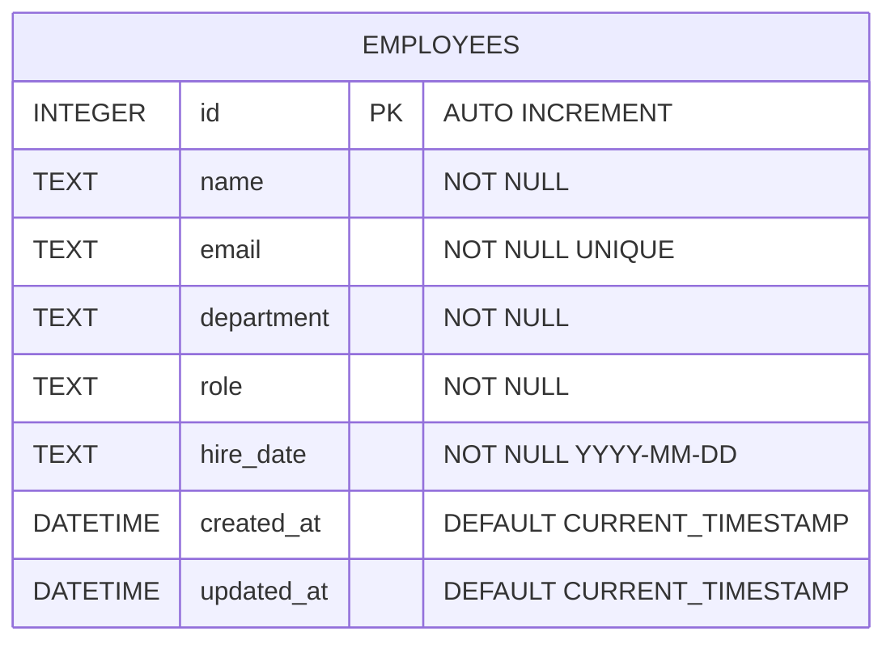
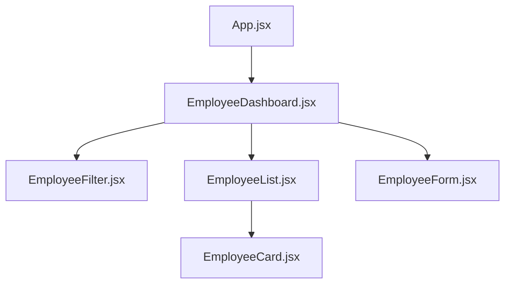
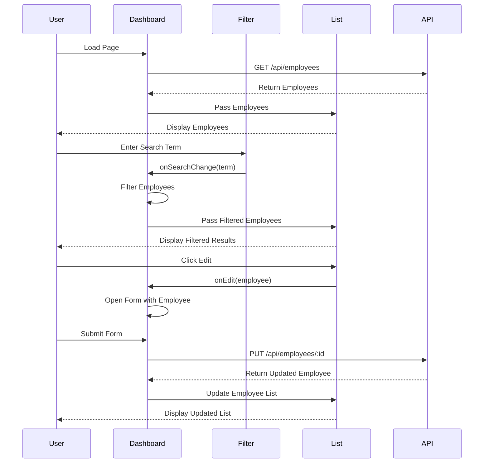
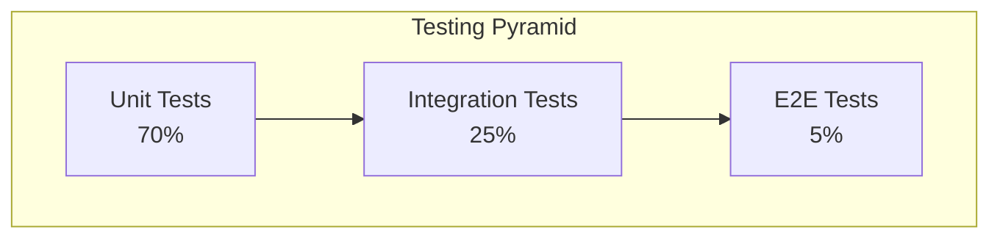
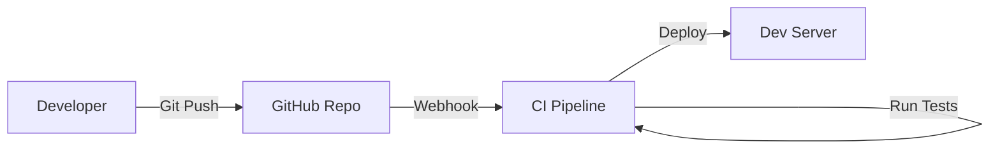
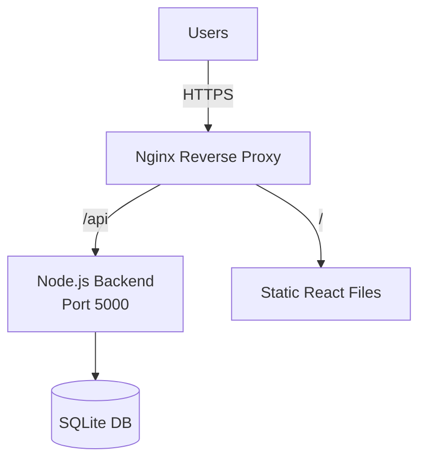
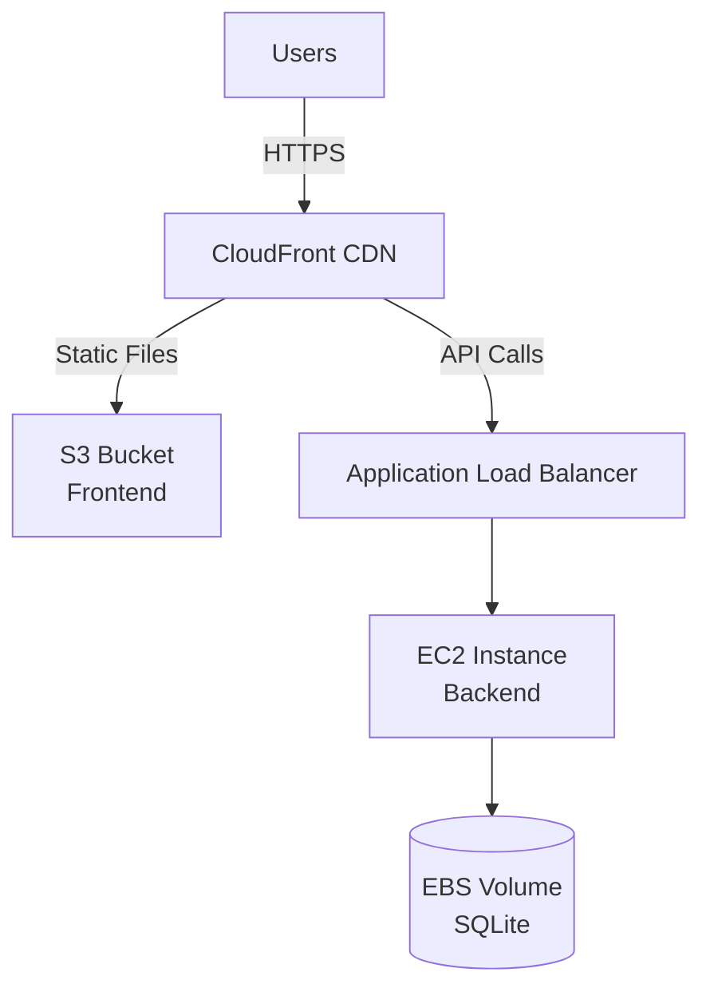
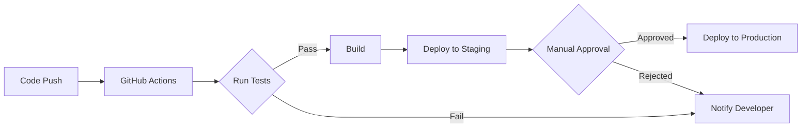

# Employee Management System - Technical Design Document

## Table of Contents
1. [Problem Statement](#problem-statement)
2. [System Architecture](#system-architecture)
3. [Technology Stack](#technology-stack)
4. [Database Design](#database-design)
5. [API Specification](#api-specification)
6. [Frontend Architecture](#frontend-architecture)
7. [Directory Structure](#directory-structure)
8. [Key Components](#key-components)
9. [Security Considerations](#security-considerations)
10. [Performance Requirements](#performance-requirements)
11. [Testing Strategy](#testing-strategy)
12. [Deployment Strategy](#deployment-strategy)
13. [Trade-offs and Alternatives](#trade-offs-and-alternatives)
14. [Success Metrics](#success-metrics)

---

## 1. Problem Statement

### Objective
Build a full-stack employee management system that allows users to perform CRUD operations on employee records with search and filter capabilities.

### Requirements
- **Backend**: RESTful API with Node.js, Express.js, and SQLite
- **Frontend**: React-based SPA with search and filter functionality
- **Data Model**: Employee with id, name, email (unique), department, role, hire_date
- **Features**: CRUD operations, name search, department filtering, rate limiting
- **Testing**: Comprehensive unit and component tests

### Constraints
- Rate limiting: 100 requests per 15 minutes per IP
- Email must be unique across all employees
- Hire date must be in YYYY-MM-DD format
- Proper error handling and validation

---

## 2. System Architecture

### High-Level Architecture



### Component Interaction Flow



---

## 3. Technology Stack

### Backend
| Technology | Version | Purpose |
|------------|---------|---------|
| Node.js | 18.x LTS | Runtime environment |
| Express.js | ^4.18.0 | Web framework |
| SQLite3 | ^5.1.0 | Database |
| express-rate-limit | ^7.1.0 | Rate limiting |
| cors | ^2.8.5 | CORS handling |
| helmet | ^7.1.0 | Security headers |
| express-validator | ^7.0.0 | Request validation |
| dotenv | ^16.3.0 | Environment configuration |

### Frontend
| Technology | Version | Purpose |
|------------|---------|---------|
| React | ^18.2.0 | UI library |
| React Router | ^6.20.0 | Client-side routing |
| Axios | ^1.6.0 | HTTP client |
| CSS Modules | - | Component styling |

### Testing
| Technology | Version | Purpose |
|------------|---------|---------|
| Jest | ^29.7.0 | Test framework |
| Supertest | ^6.3.0 | API testing |
| React Testing Library | ^14.1.0 | Component testing |
| @testing-library/jest-dom | ^6.1.0 | DOM matchers |

### Development Tools
| Technology | Version | Purpose |
|------------|---------|---------|
| ESLint | ^8.54.0 | Code linting |
| Prettier | ^3.1.0 | Code formatting |
| Nodemon | ^3.0.0 | Development server |
| Concurrently | ^8.2.0 | Run multiple commands |

---

## 4. Database Design

### Schema Definition

```sql
CREATE TABLE IF NOT EXISTS employees (
    id INTEGER PRIMARY KEY AUTOINCREMENT,
    name TEXT NOT NULL,
    email TEXT NOT NULL UNIQUE,
    department TEXT NOT NULL,
    role TEXT NOT NULL,
    hire_date TEXT NOT NULL,
    created_at DATETIME DEFAULT CURRENT_TIMESTAMP,
    updated_at DATETIME DEFAULT CURRENT_TIMESTAMP
);

CREATE INDEX idx_employees_email ON employees(email);
CREATE INDEX idx_employees_department ON employees(department);
CREATE INDEX idx_employees_name ON employees(name);
```

### Entity Relationship Diagram



### Field Specifications

| Field | Type | Constraints | Description |
|-------|------|-------------|-------------|
| id | INTEGER | PRIMARY KEY, AUTO INCREMENT | Unique identifier |
| name | TEXT | NOT NULL | Employee full name |
| email | TEXT | NOT NULL, UNIQUE | Employee email address |
| department | TEXT | NOT NULL | Department name (e.g., Engineering, HR, Sales) |
| role | TEXT | NOT NULL | Job role/title |
| hire_date | TEXT | NOT NULL | Hire date in YYYY-MM-DD format |
| created_at | DATETIME | DEFAULT CURRENT_TIMESTAMP | Record creation timestamp |
| updated_at | DATETIME | DEFAULT CURRENT_TIMESTAMP | Record update timestamp |

### Sample Data

```json
[
  {
    "id": 1,
    "name": "John Doe",
    "email": "john.doe@example.com",
    "department": "Engineering",
    "role": "Senior Developer",
    "hire_date": "2022-01-15",
    "created_at": "2024-01-01 10:00:00",
    "updated_at": "2024-01-01 10:00:00"
  },
  {
    "id": 2,
    "name": "Jane Smith",
    "email": "jane.smith@example.com",
    "department": "HR",
    "role": "HR Manager",
    "hire_date": "2021-06-20",
    "created_at": "2024-01-01 10:00:00",
    "updated_at": "2024-01-01 10:00:00"
  }
]
```

---

## 5. API Specification

### Base URL
```
http://localhost:5000/api
```

### Endpoints

#### 1. Get All Employees
```http
GET /api/employees
```

**Query Parameters:**
| Parameter | Type | Required | Description |
|-----------|------|----------|-------------|
| search | string | No | Search employees by name (case-insensitive) |
| department | string | No | Filter by department |

**Success Response (200 OK):**
```json
{
  "success": true,
  "data": [
    {
      "id": 1,
      "name": "John Doe",
      "email": "john.doe@example.com",
      "department": "Engineering",
      "role": "Senior Developer",
      "hire_date": "2022-01-15"
    }
  ],
  "count": 1
}
```

**Example Requests:**
```bash
# Get all employees
GET /api/employees

# Search by name
GET /api/employees?search=john

# Filter by department
GET /api/employees?department=Engineering

# Combined search and filter
GET /api/employees?search=john&department=Engineering
```

---

#### 2. Get Single Employee
```http
GET /api/employees/:id
```

**URL Parameters:**
| Parameter | Type | Description |
|-----------|------|-------------|
| id | integer | Employee ID |

**Success Response (200 OK):**
```json
{
  "success": true,
  "data": {
    "id": 1,
    "name": "John Doe",
    "email": "john.doe@example.com",
    "department": "Engineering",
    "role": "Senior Developer",
    "hire_date": "2022-01-15"
  }
}
```

**Error Response (404 Not Found):**
```json
{
  "success": false,
  "error": "Employee not found"
}
```

---

#### 3. Create Employee
```http
POST /api/employees
```

**Request Body:**
```json
{
  "name": "John Doe",
  "email": "john.doe@example.com",
  "department": "Engineering",
  "role": "Senior Developer",
  "hire_date": "2022-01-15"
}
```

**Validation Rules:**
- `name`: Required, non-empty string
- `email`: Required, valid email format, unique
- `department`: Required, non-empty string
- `role`: Required, non-empty string
- `hire_date`: Required, valid date in YYYY-MM-DD format

**Success Response (201 Created):**
```json
{
  "success": true,
  "data": {
    "id": 1,
    "name": "John Doe",
    "email": "john.doe@example.com",
    "department": "Engineering",
    "role": "Senior Developer",
    "hire_date": "2022-01-15"
  },
  "message": "Employee created successfully"
}
```

**Error Response (400 Bad Request):**
```json
{
  "success": false,
  "errors": [
    {
      "field": "email",
      "message": "Email already exists"
    }
  ]
}
```

---

#### 4. Update Employee
```http
PUT /api/employees/:id
```

**URL Parameters:**
| Parameter | Type | Description |
|-----------|------|-------------|
| id | integer | Employee ID |

**Request Body:**
```json
{
  "name": "John Doe Updated",
  "email": "john.updated@example.com",
  "department": "Engineering",
  "role": "Lead Developer",
  "hire_date": "2022-01-15"
}
```

**Success Response (200 OK):**
```json
{
  "success": true,
  "data": {
    "id": 1,
    "name": "John Doe Updated",
    "email": "john.updated@example.com",
    "department": "Engineering",
    "role": "Lead Developer",
    "hire_date": "2022-01-15"
  },
  "message": "Employee updated successfully"
}
```

---

#### 5. Delete Employee
```http
DELETE /api/employees/:id
```

**URL Parameters:**
| Parameter | Type | Description |
|-----------|------|-------------|
| id | integer | Employee ID |

**Success Response (200 OK):**
```json
{
  "success": true,
  "message": "Employee deleted successfully"
}
```

**Error Response (404 Not Found):**
```json
{
  "success": false,
  "error": "Employee not found"
}
```

---

### Error Responses

#### Rate Limit Exceeded (429)
```json
{
  "success": false,
  "error": "Too many requests, please try again later."
}
```

#### Validation Error (400)
```json
{
  "success": false,
  "errors": [
    {
      "field": "email",
      "message": "Invalid email format"
    },
    {
      "field": "hire_date",
      "message": "Invalid date format. Use YYYY-MM-DD"
    }
  ]
}
```

#### Server Error (500)
```json
{
  "success": false,
  "error": "Internal server error"
}
```

---

## 6. Frontend Architecture

### Component Hierarchy



### Component Breakdown

#### 1. App Component
**Purpose:** Root component, routing setup
- Manages global state (if needed)
- Provides routing configuration
- Wraps application in providers

#### 2. EmployeeDashboard Component
**Purpose:** Main container for employee management
- Fetches employee data from API
- Manages employee state
- Handles search and filter logic
- Coordinates child components

**State:**
```javascript
{
  employees: [],
  filteredEmployees: [],
  selectedEmployee: null,
  isFormOpen: false,
  searchTerm: '',
  selectedDepartment: '',
  loading: false,
  error: null
}
```

#### 3. EmployeeFilter Component
**Purpose:** Search and filter controls
- Search input for name filtering
- Department dropdown for filtering
- Emits filter changes to parent

**Props:**
```javascript
{
  searchTerm: string,
  selectedDepartment: string,
  departments: string[],
  onSearchChange: (term: string) => void,
  onDepartmentChange: (dept: string) => void
}
```

#### 4. EmployeeList Component
**Purpose:** Display employee cards
- Renders list of employees
- Handles empty states
- Provides edit/delete actions

**Props:**
```javascript
{
  employees: Employee[],
  loading: boolean,
  onEdit: (employee: Employee) => void,
  onDelete: (id: number) => void
}
```

#### 5. EmployeeCard Component
**Purpose:** Display individual employee
- Shows employee details
- Provides action buttons
- Responsive design

**Props:**
```javascript
{
  employee: Employee,
  onEdit: () => void,
  onDelete: () => void
}
```

#### 6. EmployeeForm Component
**Purpose:** Add/Edit employee form
- Modal or side panel design
- Form validation
- Handles create and update

**Props:**
```javascript
{
  employee: Employee | null,
  isOpen: boolean,
  onClose: () => void,
  onSubmit: (data: Employee) => void
}
```

### Data Flow



---

## 7. Directory Structure

```
employee-management-app/
├── backend/
│   ├── src/
│   │   ├── config/
│   │   │   ├── database.js          # SQLite configuration
│   │   │   └── rateLimiter.js       # Rate limit configuration
│   │   ├── controllers/
│   │   │   └── employeeController.js # Business logic for employees
│   │   ├── middleware/
│   │   │   ├── errorHandler.js      # Global error handler
│   │   │   └── validator.js         # Request validation
│   │   ├── models/
│   │   │   └── employeeModel.js     # Database queries
│   │   ├── routes/
│   │   │   └── employeeRoutes.js    # API route definitions
│   │   ├── utils/
│   │   │   ├── logger.js            # Logging utility
│   │   │   └── validation.js        # Validation helpers
│   │   ├── app.js                   # Express app setup
│   │   └── server.js                # Server entry point
│   ├── tests/
│   │   ├── integration/
│   │   │   └── employee.test.js     # API integration tests
│   │   ├── unit/
│   │   │   ├── employeeController.test.js
│   │   │   └── employeeModel.test.js
│   │   └── setup.js                 # Test configuration
│   ├── database/
│   │   └── employees.db             # SQLite database file
│   ├── .env.example                 # Environment variables template
│   ├── .eslintrc.js                 # ESLint configuration
│   ├── .prettierrc                  # Prettier configuration
│   ├── package.json
│   └── README.md
│
├── frontend/
│   ├── public/
│   │   ├── index.html
│   │   └── favicon.ico
│   ├── src/
│   │   ├── components/
│   │   │   ├── EmployeeCard/
│   │   │   │   ├── EmployeeCard.jsx
│   │   │   │   ├── EmployeeCard.module.css
│   │   │   │   └── EmployeeCard.test.jsx
│   │   │   ├── EmployeeFilter/
│   │   │   │   ├── EmployeeFilter.jsx
│   │   │   │   ├── EmployeeFilter.module.css
│   │   │   │   └── EmployeeFilter.test.jsx
│   │   │   ├── EmployeeForm/
│   │   │   │   ├── EmployeeForm.jsx
│   │   │   │   ├── EmployeeForm.module.css
│   │   │   │   └── EmployeeForm.test.jsx
│   │   │   ├── EmployeeList/
│   │   │   │   ├── EmployeeList.jsx
│   │   │   │   ├── EmployeeList.module.css
│   │   │   │   └── EmployeeList.test.jsx
│   │   │   └── common/
│   │   │       ├── Button/
│   │   │       ├── Input/
│   │   │       ├── Modal/
│   │   │       └── Spinner/
│   │   ├── pages/
│   │   │   └── EmployeeDashboard/
│   │   │       ├── EmployeeDashboard.jsx
│   │   │       ├── EmployeeDashboard.module.css
│   │   │       └── EmployeeDashboard.test.jsx
│   │   ├── services/
│   │   │   └── api.js               # API service layer
│   │   ├── hooks/
│   │   │   └── useEmployees.js      # Custom hook for employee data
│   │   ├── utils/
│   │   │   ├── constants.js         # App constants
│   │   │   └── validators.js        # Form validators
│   │   ├── App.jsx                  # Root component
│   │   ├── App.css                  # Global styles
│   │   ├── index.jsx                # Entry point
│   │   └── setupTests.js            # Test setup
│   ├── .env.example
│   ├── .eslintrc.js
│   ├── .prettierrc
│   ├── package.json
│   └── README.md
│
├── .gitignore
├── DESIGN.md                        # This file
├── README.md                        # Project overview
└── package.json                     # Root package.json for scripts
```

---

## 8. Key Components

### Backend Key Files

#### 1. `backend/src/server.js`
**Purpose:** Application entry point
```javascript
// Starts the Express server
// Connects to database
// Handles graceful shutdown
```

#### 2. `backend/src/app.js`
**Purpose:** Express application setup
```javascript
// Middleware configuration
// Route mounting
// Error handling
// CORS setup
```

#### 3. `backend/src/config/database.js`
**Purpose:** Database configuration and initialization
```javascript
// SQLite connection
// Table creation
// Migration logic
```

#### 4. `backend/src/models/employeeModel.js`
**Purpose:** Database queries and data access layer
```javascript
// CRUD operations
// Search and filter queries
// Data transformation
```

#### 5. `backend/src/controllers/employeeController.js`
**Purpose:** Business logic and request handling
```javascript
// Request validation
// Error handling
// Response formatting
```

#### 6. `backend/src/routes/employeeRoutes.js`
**Purpose:** API route definitions
```javascript
// Route definitions
// Middleware attachment
// Parameter validation
```

#### 7. `backend/src/middleware/errorHandler.js`
**Purpose:** Centralized error handling
```javascript
// Error formatting
// Logging
// Status code mapping
```

#### 8. `backend/src/config/rateLimiter.js`
**Purpose:** Rate limiting configuration
```javascript
// Configure 100 requests per 15 minutes
// Custom error messages
// IP-based limiting
```

---

### Frontend Key Files

#### 1. `frontend/src/index.jsx`
**Purpose:** Application entry point
```javascript
// React DOM rendering
// Root component mounting
```

#### 2. `frontend/src/App.jsx`
**Purpose:** Root component
```javascript
// Application layout
// Global providers
```

#### 3. `frontend/src/services/api.js`
**Purpose:** API communication layer
```javascript
// Axios instance configuration
// API endpoints
// Error interceptors
// Request/response transformers
```

**Key Functions:**
```javascript
const api = {
  // Employee CRUD
  getEmployees: (params) => axios.get('/employees', { params }),
  getEmployee: (id) => axios.get(`/employees/${id}`),
  createEmployee: (data) => axios.post('/employees', data),
  updateEmployee: (id, data) => axios.put(`/employees/${id}`, data),
  deleteEmployee: (id) => axios.delete(`/employees/${id}`)
};
```

#### 4. `frontend/src/hooks/useEmployees.js`
**Purpose:** Custom hook for employee data management
```javascript
// Fetch employees
// Handle loading states
// Error handling
// Cache management
```

#### 5. `frontend/src/pages/EmployeeDashboard/EmployeeDashboard.jsx`
**Purpose:** Main dashboard page
```javascript
// State management
// Search/filter logic
// Child component coordination
```

#### 6. `frontend/src/components/EmployeeForm/EmployeeForm.jsx`
**Purpose:** Employee creation/editing form
```javascript
// Form state management
// Validation
// Submit handling
```

#### 7. `frontend/src/components/EmployeeList/EmployeeList.jsx`
**Purpose:** Display employee list
```javascript
// Render employee cards
// Empty states
// Loading states
```

#### 8. `frontend/src/components/EmployeeFilter/EmployeeFilter.jsx`
**Purpose:** Search and filter controls
```javascript
// Search input
// Department filter
// Event handling
```

---

## 9. Security Considerations

### 1. Rate Limiting
**Implementation:**
- 100 requests per 15 minutes per IP address
- Using `express-rate-limit` middleware
- Custom error messages

**Configuration:**
```javascript
const rateLimit = require('express-rate-limit');

const limiter = rateLimit({
  windowMs: 15 * 60 * 1000, // 15 minutes
  max: 100, // 100 requests per windowMs
  message: {
    success: false,
    error: 'Too many requests, please try again later.'
  },
  standardHeaders: true,
  legacyHeaders: false
});
```

### 2. Input Validation
**Backend Validation:**
- Use `express-validator` for all inputs
- Sanitize user inputs
- Validate data types and formats
- Check for SQL injection patterns

**Frontend Validation:**
- Client-side validation for immediate feedback
- Validate email format
- Date format validation (YYYY-MM-DD)
- Required field checks

### 3. SQL Injection Prevention
- Use parameterized queries
- Prepared statements with SQLite3
- Never concatenate user input into SQL

**Example:**
```javascript
// ✅ SAFE - Parameterized query
db.get('SELECT * FROM employees WHERE id = ?', [id]);

// ❌ UNSAFE - String concatenation
db.get(`SELECT * FROM employees WHERE id = ${id}`);
```

### 4. CORS Configuration
- Whitelist specific origins in production
- Disable CORS in development for ease
- Secure credentials handling

```javascript
const corsOptions = {
  origin: process.env.FRONTEND_URL || 'http://localhost:3000',
  credentials: true,
  optionsSuccessStatus: 200
};
```

### 5. HTTP Security Headers
- Use `helmet` middleware
- Set Content Security Policy
- Enable HSTS
- Prevent clickjacking

### 6. Error Handling
- Never expose stack traces in production
- Generic error messages to clients
- Detailed logging server-side
- Sanitize error messages

### 7. Data Validation
**Email Uniqueness:**
- Database constraint (UNIQUE)
- Application-level check before insert
- Proper error messaging

**Date Validation:**
- YYYY-MM-DD format enforcement
- Valid date range checks
- Prevent future dates (optional)

---

## 10. Performance Requirements

### 1. Response Time Targets
| Operation | Target | Acceptable |
|-----------|--------|------------|
| GET all employees | < 100ms | < 200ms |
| GET single employee | < 50ms | < 100ms |
| POST create employee | < 150ms | < 300ms |
| PUT update employee | < 150ms | < 300ms |
| DELETE employee | < 100ms | < 200ms |
| Search/Filter | < 100ms | < 200ms |

### 2. Database Optimization
**Indexes:**
- Primary key index on `id` (automatic)
- Index on `email` for uniqueness checks
- Index on `department` for filtering
- Index on `name` for search operations

**Query Optimization:**
```sql
-- Efficient search query with index
SELECT * FROM employees 
WHERE name LIKE ? || '%' 
COLLATE NOCASE;

-- Efficient filter with index
SELECT * FROM employees 
WHERE department = ?;

-- Combined search and filter
SELECT * FROM employees 
WHERE name LIKE ? || '%' 
  AND department = ?
COLLATE NOCASE;
```

### 3. Frontend Performance
**Optimization Strategies:**
- Debounce search input (300ms delay)
- Memoize filtered results
- Virtual scrolling for large lists (if > 100 employees)
- Code splitting with React.lazy
- Image optimization
- Bundle size optimization

**Debounce Example:**
```javascript
const [searchTerm, setSearchTerm] = useState('');
const debouncedSearch = useDebounce(searchTerm, 300);

useEffect(() => {
  // Trigger search only after 300ms of no typing
  fetchEmployees({ search: debouncedSearch });
}, [debouncedSearch]);
```

### 4. Caching Strategy
**Backend:**
- No caching needed for SQLite (small dataset)
- Consider Redis if dataset grows

**Frontend:**
- Cache employee list in state
- Optimistic UI updates
- Stale-while-revalidate pattern

### 5. Scalability Considerations
**Current Scale (< 10,000 employees):**
- SQLite is sufficient
- Single server deployment
- No caching needed

**Future Scale (> 10,000 employees):**
- Migrate to PostgreSQL/MySQL
- Implement pagination (limit/offset)
- Add response caching
- Consider database connection pooling

---

## 11. Testing Strategy

### Testing Pyramid



### Backend Testing

#### 1. Unit Tests (70%)
**Files to Test:**
- `employeeModel.js` - Database operations
- `employeeController.js` - Business logic
- `validator.js` - Validation functions

**Example Test:**
```javascript
// tests/unit/employeeModel.test.js
describe('EmployeeModel', () => {
  describe('create', () => {
    it('should create employee with valid data', async () => {
      const employee = {
        name: 'John Doe',
        email: 'john@example.com',
        department: 'Engineering',
        role: 'Developer',
        hire_date: '2022-01-15'
      };
      
      const result = await EmployeeModel.create(employee);
      
      expect(result).toHaveProperty('id');
      expect(result.name).toBe(employee.name);
    });
    
    it('should reject duplicate email', async () => {
      const employee = {
        name: 'John Doe',
        email: 'existing@example.com',
        department: 'Engineering',
        role: 'Developer',
        hire_date: '2022-01-15'
      };
      
      await expect(EmployeeModel.create(employee))
        .rejects.toThrow('Email already exists');
    });
  });
});
```

#### 2. Integration Tests (25%)
**API Endpoint Tests:**
- Test all CRUD operations
- Test search functionality
- Test filter functionality
- Test error responses
- Test rate limiting

**Example Test:**
```javascript
// tests/integration/employee.test.js
const request = require('supertest');
const app = require('../../src/app');

describe('Employee API', () => {
  describe('POST /api/employees', () => {
    it('should create new employee', async () => {
      const employee = {
        name: 'John Doe',
        email: 'john@example.com',
        department: 'Engineering',
        role: 'Developer',
        hire_date: '2022-01-15'
      };
      
      const res = await request(app)
        .post('/api/employees')
        .send(employee)
        .expect(201);
      
      expect(res.body.success).toBe(true);
      expect(res.body.data).toHaveProperty('id');
      expect(res.body.data.name).toBe(employee.name);
    });
    
    it('should return 400 for invalid email', async () => {
      const employee = {
        name: 'John Doe',
        email: 'invalid-email',
        department: 'Engineering',
        role: 'Developer',
        hire_date: '2022-01-15'
      };
      
      const res = await request(app)
        .post('/api/employees')
        .send(employee)
        .expect(400);
      
      expect(res.body.success).toBe(false);
      expect(res.body.errors).toBeDefined();
    });
  });
  
  describe('GET /api/employees', () => {
    it('should filter by department', async () => {
      const res = await request(app)
        .get('/api/employees?department=Engineering')
        .expect(200);
      
      expect(res.body.success).toBe(true);
      expect(res.body.data).toBeInstanceOf(Array);
      res.body.data.forEach(emp => {
        expect(emp.department).toBe('Engineering');
      });
    });
    
    it('should search by name', async () => {
      const res = await request(app)
        .get('/api/employees?search=john')
        .expect(200);
      
      expect(res.body.success).toBe(true);
      res.body.data.forEach(emp => {
        expect(emp.name.toLowerCase()).toContain('john');
      });
    });
  });
  
  describe('Rate Limiting', () => {
    it('should reject after 100 requests', async () => {
      // Make 101 requests
      for (let i = 0; i < 101; i++) {
        const res = await request(app).get('/api/employees');
        
        if (i < 100) {
          expect(res.status).not.toBe(429);
        } else {
          expect(res.status).toBe(429);
          expect(res.body.error).toContain('Too many requests');
        }
      }
    }, 30000); // Increase timeout
  });
});
```

#### 3. Test Coverage Target
- Overall: > 80%
- Critical paths: 100%
- Controllers: > 90%
- Models: > 90%

---

### Frontend Testing

#### 1. Component Tests (70%)
**Components to Test:**
- EmployeeForm
- EmployeeList
- EmployeeCard
- EmployeeFilter

**Example Test:**
```javascript
// src/components/EmployeeForm/EmployeeForm.test.jsx
import { render, screen, fireEvent, waitFor } from '@testing-library/react';
import EmployeeForm from './EmployeeForm';

describe('EmployeeForm', () => {
  it('should render form fields', () => {
    render(<EmployeeForm isOpen={true} onClose={jest.fn()} onSubmit={jest.fn()} />);
    
    expect(screen.getByLabelText(/name/i)).toBeInTheDocument();
    expect(screen.getByLabelText(/email/i)).toBeInTheDocument();
    expect(screen.getByLabelText(/department/i)).toBeInTheDocument();
    expect(screen.getByLabelText(/role/i)).toBeInTheDocument();
    expect(screen.getByLabelText(/hire date/i)).toBeInTheDocument();
  });
  
  it('should validate required fields', async () => {
    const onSubmit = jest.fn();
    render(<EmployeeForm isOpen={true} onClose={jest.fn()} onSubmit={onSubmit} />);
    
    fireEvent.click(screen.getByRole('button', { name: /submit/i }));
    
    await waitFor(() => {
      expect(screen.getByText(/name is required/i)).toBeInTheDocument();
      expect(screen.getByText(/email is required/i)).toBeInTheDocument();
    });
    
    expect(onSubmit).not.toHaveBeenCalled();
  });
  
  it('should submit valid form data', async () => {
    const onSubmit = jest.fn();
    render(<EmployeeForm isOpen={true} onClose={jest.fn()} onSubmit={onSubmit} />);
    
    fireEvent.change(screen.getByLabelText(/name/i), {
      target: { value: 'John Doe' }
    });
    fireEvent.change(screen.getByLabelText(/email/i), {
      target: { value: 'john@example.com' }
    });
    fireEvent.change(screen.getByLabelText(/department/i), {
      target: { value: 'Engineering' }
    });
    fireEvent.change(screen.getByLabelText(/role/i), {
      target: { value: 'Developer' }
    });
    fireEvent.change(screen.getByLabelText(/hire date/i), {
      target: { value: '2022-01-15' }
    });
    
    fireEvent.click(screen.getByRole('button', { name: /submit/i }));
    
    await waitFor(() => {
      expect(onSubmit).toHaveBeenCalledWith({
        name: 'John Doe',
        email: 'john@example.com',
        department: 'Engineering',
        role: 'Developer',
        hire_date: '2022-01-15'
      });
    });
  });
  
  it('should populate form in edit mode', () => {
    const employee = {
      id: 1,
      name: 'John Doe',
      email: 'john@example.com',
      department: 'Engineering',
      role: 'Developer',
      hire_date: '2022-01-15'
    };
    
    render(
      <EmployeeForm 
        isOpen={true} 
        employee={employee}
        onClose={jest.fn()} 
        onSubmit={jest.fn()} 
      />
    );
    
    expect(screen.getByLabelText(/name/i)).toHaveValue('John Doe');
    expect(screen.getByLabelText(/email/i)).toHaveValue('john@example.com');
  });
});
```

```javascript
// src/components/EmployeeFilter/EmployeeFilter.test.jsx
import { render, screen, fireEvent } from '@testing-library/react';
import EmployeeFilter from './EmployeeFilter';

describe('EmployeeFilter', () => {
  it('should call onSearchChange when typing', () => {
    const onSearchChange = jest.fn();
    render(
      <EmployeeFilter
        searchTerm=""
        selectedDepartment=""
        departments={['Engineering', 'HR']}
        onSearchChange={onSearchChange}
        onDepartmentChange={jest.fn()}
      />
    );
    
    fireEvent.change(screen.getByPlaceholderText(/search/i), {
      target: { value: 'john' }
    });
    
    expect(onSearchChange).toHaveBeenCalledWith('john');
  });
  
  it('should call onDepartmentChange when selecting department', () => {
    const onDepartmentChange = jest.fn();
    render(
      <EmployeeFilter
        searchTerm=""
        selectedDepartment=""
        departments={['Engineering', 'HR']}
        onSearchChange={jest.fn()}
        onDepartmentChange={onDepartmentChange}
      />
    );
    
    fireEvent.change(screen.getByRole('combobox'), {
      target: { value: 'Engineering' }
    });
    
    expect(onDepartmentChange).toHaveBeenCalledWith('Engineering');
  });
});
```

#### 2. Integration Tests (25%)
**Page-level Tests:**
- Test EmployeeDashboard with all child components
- Test data flow between components
- Test API integration with mocked responses

#### 3. Test Coverage Target
- Overall: > 80%
- Components: > 85%
- Utils: > 90%

---

### Test Execution

**Backend:**
```bash
# Run all tests
npm test

# Run with coverage
npm run test:coverage

# Run specific test file
npm test -- employee.test.js

# Watch mode
npm test -- --watch
```

**Frontend:**
```bash
# Run all tests
npm test

# Run with coverage
npm test -- --coverage

# Run specific test
npm test -- EmployeeForm.test.jsx

# Watch mode
npm test
```

---

## 12. Deployment Strategy

### Development Environment



**Setup:**
```bash
# Backend (Port 5000)
cd backend
npm install
npm run dev

# Frontend (Port 3000)
cd frontend
npm install
npm start
```

---

### Production Deployment Options

#### Option 1: Single Server Deployment (Recommended for MVP)



**Setup:**
1. Build frontend: `npm run build`
2. Serve static files via Nginx
3. Proxy `/api` requests to backend
4. Use PM2 for backend process management

**Nginx Configuration:**
```nginx
server {
    listen 80;
    server_name example.com;
    
    # Frontend
    location / {
        root /var/www/frontend/build;
        try_files $uri /index.html;
    }
    
    # Backend API
    location /api {
        proxy_pass http://localhost:5000;
        proxy_http_version 1.1;
        proxy_set_header Upgrade $http_upgrade;
        proxy_set_header Connection 'upgrade';
        proxy_set_header Host $host;
        proxy_cache_bypass $http_upgrade;
    }
}
```

---

#### Option 2: Containerized Deployment (Docker)

```yaml
# docker-compose.yml
version: '3.8'

services:
  backend:
    build: ./backend
    ports:
      - "5000:5000"
    volumes:
      - ./backend/database:/app/database
    environment:
      - NODE_ENV=production
    restart: unless-stopped
  
  frontend:
    build: ./frontend
    ports:
      - "80:80"
    depends_on:
      - backend
    restart: unless-stopped
```

---

#### Option 3: Cloud Deployment (AWS/Azure/GCP)

**AWS Architecture:**


**Components:**
- **Frontend**: S3 + CloudFront
- **Backend**: EC2 with Auto Scaling
- **Database**: EBS volume (or migrate to RDS)
- **SSL**: AWS Certificate Manager
- **Monitoring**: CloudWatch

---

### CI/CD Pipeline



**GitHub Actions Workflow:**
```yaml
name: CI/CD Pipeline

on:
  push:
    branches: [main, develop]
  pull_request:
    branches: [main]

jobs:
  test-backend:
    runs-on: ubuntu-latest
    steps:
      - uses: actions/checkout@v3
      - uses: actions/setup-node@v3
        with:
          node-version: '18'
      - run: cd backend && npm install
      - run: cd backend && npm test
      - run: cd backend && npm run test:coverage

  test-frontend:
    runs-on: ubuntu-latest
    steps:
      - uses: actions/checkout@v3
      - uses: actions/setup-node@v3
        with:
          node-version: '18'
      - run: cd frontend && npm install
      - run: cd frontend && npm test -- --coverage

  deploy:
    needs: [test-backend, test-frontend]
    runs-on: ubuntu-latest
    if: github.ref == 'refs/heads/main'
    steps:
      - uses: actions/checkout@v3
      - name: Deploy to Production
        run: |
          # Add deployment scripts here
          echo "Deploying to production..."
```

---

### Environment Variables

**Backend (.env):**
```bash
NODE_ENV=production
PORT=5000
DATABASE_PATH=./database/employees.db
CORS_ORIGIN=https://example.com
RATE_LIMIT_WINDOW_MS=900000
RATE_LIMIT_MAX_REQUESTS=100
LOG_LEVEL=info
```

**Frontend (.env):**
```bash
REACT_APP_API_URL=https://api.example.com/api
REACT_APP_ENV=production
```

---

### Monitoring and Logging

**Tools:**
- **Logging**: Winston (backend), Console (frontend)
- **Monitoring**: PM2 monitoring, CloudWatch
- **Error Tracking**: Sentry (optional)
- **Uptime Monitoring**: Pingdom/UptimeRobot

**Key Metrics:**
- API response times
- Error rates
- Request counts
- Database query performance
- Rate limit hits
- Memory usage
- CPU usage

---

## 13. Trade-offs and Alternatives

### 1. Database Choice: SQLite vs PostgreSQL

**Decision: SQLite** ✅

| Aspect | SQLite | PostgreSQL |
|--------|--------|------------|
| Setup Complexity | Simple, no server | Requires server setup |
| Performance (< 10K records) | Excellent | Excellent |
| Performance (> 100K records) | Degraded | Better |
| Scalability | Limited | High |
| Concurrent Writes | Limited | Excellent |
| Deployment | Single file | Separate service |
| Cost | Free, no overhead | Infrastructure cost |

**Rationale:**
- For MVP and small-scale applications, SQLite is sufficient
- No additional infrastructure needed
- Easy to migrate to PostgreSQL later if needed
- Perfect for embedded deployment

**Migration Path:**
If scaling beyond 10,000 employees or requiring high concurrent writes, migrate to PostgreSQL.

---

### 2. State Management: useState vs Redux

**Decision: useState + Context** ✅

| Aspect | useState + Context | Redux |
|--------|-------------------|--------|
| Complexity | Low | High |
| Boilerplate | Minimal | Significant |
| Learning Curve | Easy | Steep |
| DevTools | Basic | Excellent |
| Performance | Good | Better (large apps) |
| Time to Implement | Fast | Slow |

**Rationale:**
- Application state is simple (employee list, filters)
- No complex state interactions
- Faster development for MVP
- Can migrate to Redux if state becomes complex

---

### 3. Styling: CSS Modules vs Styled Components vs Tailwind

**Decision: CSS Modules** ✅

| Aspect | CSS Modules | Styled Components | Tailwind CSS |
|--------|-------------|------------------|--------------|
| Learning Curve | Low | Medium | Medium |
| Performance | Best | Good | Good |
| Bundle Size | Smallest | Larger | Medium |
| Developer Experience | Familiar | Modern | Fast |
| Customization | Full control | Full control | Utility-based |

**Rationale:**
- Familiar to most developers
- No runtime overhead
- Good balance of simplicity and power
- Easy to maintain

**Alternative:**
Tailwind CSS would speed up development but adds learning curve.

---

### 4. Form Handling: Controlled vs Uncontrolled

**Decision: Controlled Components** ✅

**Rationale:**
- Better validation control
- Easier to implement search-as-you-type
- React recommended approach
- Consistent with React patterns

---

### 5. API Design: REST vs GraphQL

**Decision: REST** ✅

| Aspect | REST | GraphQL |
|--------|------|---------|
| Complexity | Low | High |
| Learning Curve | Low | Steep |
| Over-fetching | Possible | Eliminated |
| Caching | Easy | Complex |
| Tooling | Mature | Growing |
| Use Case Fit | CRUD operations | Complex queries |

**Rationale:**
- Simple CRUD operations suit REST perfectly
- Team familiarity
- Easier to implement and maintain
- Built-in HTTP caching

---

### 6. Testing: Jest vs Mocha

**Decision: Jest** ✅

**Rationale:**
- All-in-one solution (test runner, assertions, mocks)
- Better React integration
- Snapshot testing
- Faster setup
- Better developer experience

---

## 14. Success Metrics

### Development Metrics

| Metric | Target | Measurement |
|--------|--------|-------------|
| Time to MVP | 2-3 weeks | Calendar days |
| Code Coverage | > 80% | Jest/Coverage reports |
| Build Time | < 2 minutes | CI/CD pipeline |
| Test Execution Time | < 30 seconds | Test suite runtime |

---

### Performance Metrics

| Metric | Target | Critical Threshold |
|--------|--------|-------------------|
| API Response Time (p95) | < 200ms | < 500ms |
| Frontend Load Time | < 2s | < 4s |
| Time to Interactive | < 3s | < 5s |
| API Error Rate | < 0.1% | < 1% |
| Uptime | > 99.9% | > 99% |

---

### User Experience Metrics

| Metric | Target | Measurement Method |
|--------|--------|-------------------|
| Search Response Time | < 300ms | User perception |
| Form Submission Feedback | Immediate | Visual feedback |
| Error Message Clarity | 100% | User testing |
| Mobile Responsiveness | All devices | Cross-device testing |

---

### Quality Metrics

| Metric | Target | Tool |
|--------|--------|------|
| ESLint Errors | 0 | ESLint |
| Security Vulnerabilities | 0 critical | npm audit |
| Bundle Size (Frontend) | < 500KB | Webpack analyzer |
| Accessibility Score | > 90 | Lighthouse |
| Code Maintainability | Grade A | CodeClimate |

---

### Business Metrics (Post-Launch)

| Metric | Target | Description |
|--------|--------|-------------|
| User Adoption | 80% | % of employees using system |
| Task Completion Rate | > 95% | Successfully completed operations |
| User Satisfaction | > 4/5 | User survey score |
| Support Tickets | < 5/week | Technical support requests |
| System Reliability | > 99.5% | Uptime percentage |

---

## 15. Implementation Phases

### Phase 1: Foundation (Week 1)
**Backend:**
- [x] Project setup and dependencies
- [x] Database schema and initialization
- [x] Basic Express server
- [x] CRUD API endpoints
- [x] Input validation
- [x] Error handling

**Frontend:**
- [x] React app setup
- [x] Component structure
- [x] API service layer
- [x] Basic routing

**Deliverable:** Working CRUD operations without UI polish

---

### Phase 2: Features (Week 2)
**Backend:**
- [x] Search functionality
- [x] Filter by department
- [x] Rate limiting
- [x] Comprehensive error handling

**Frontend:**
- [x] EmployeeList component
- [x] EmployeeForm component
- [x] EmployeeFilter component
- [x] Search and filter UI
- [x] Form validation

**Deliverable:** Full-featured application

---

### Phase 3: Testing & Polish (Week 3)
**Backend:**
- [x] Unit tests (controllers, models)
- [x] Integration tests (API endpoints)
- [x] Rate limit testing

**Frontend:**
- [x] Component tests
- [x] Integration tests
- [x] UI/UX improvements
- [x] Responsive design
- [x] Error handling UX

**Deliverable:** Production-ready application

---

### Phase 4: Deployment (Week 3-4)
- [x] CI/CD pipeline setup
- [x] Production environment configuration
- [x] Deployment scripts
- [x] Monitoring setup
- [x] Documentation

**Deliverable:** Deployed application

---

## 16. Future Enhancements

### Short-term (3-6 months)
1. **Pagination** - Handle large employee lists efficiently
2. **Sorting** - Sort by name, hire date, department
3. **Export** - Export employee data to CSV/Excel
4. **Advanced Filters** - Filter by hire date range, multiple departments
5. **Bulk Operations** - Upload/delete multiple employees

### Medium-term (6-12 months)
1. **Authentication** - User login and role-based access
2. **Audit Log** - Track all changes to employee records
3. **File Upload** - Employee photos and documents
4. **Email Notifications** - Notify on employee changes
5. **Dashboard** - Analytics and visualizations

### Long-term (12+ months)
1. **Multi-tenancy** - Support multiple organizations
2. **Advanced Reporting** - Custom reports and analytics
3. **Integration** - Connect with HR systems (Workday, BambooHR)
4. **Mobile App** - Native iOS/Android applications
5. **Migration to Microservices** - Scale individual components

---

## Conclusion

This design document provides a comprehensive blueprint for building a scalable, secure, and maintainable employee management system. The architecture balances simplicity for rapid development with the flexibility to scale as requirements grow.

### Key Design Decisions
1. **SQLite for MVP** - Simple, sufficient for initial scale
2. **REST API** - Familiar, well-suited for CRUD operations
3. **React with hooks** - Modern, performant frontend
4. **Comprehensive testing** - Ensures reliability
5. **Rate limiting** - Prevents abuse
6. **Input validation** - Security and data integrity

### Next Steps
1. Review and approve this design document
2. Set up development environment
3. Begin Phase 1 implementation
4. Establish CI/CD pipeline
5. Regular sprint reviews and iterations

---

**Document Version:** 1.0  
**Last Updated:** 2024-02-12  
**Author:** Technical Design Team  
**Status:** Ready for Implementation
